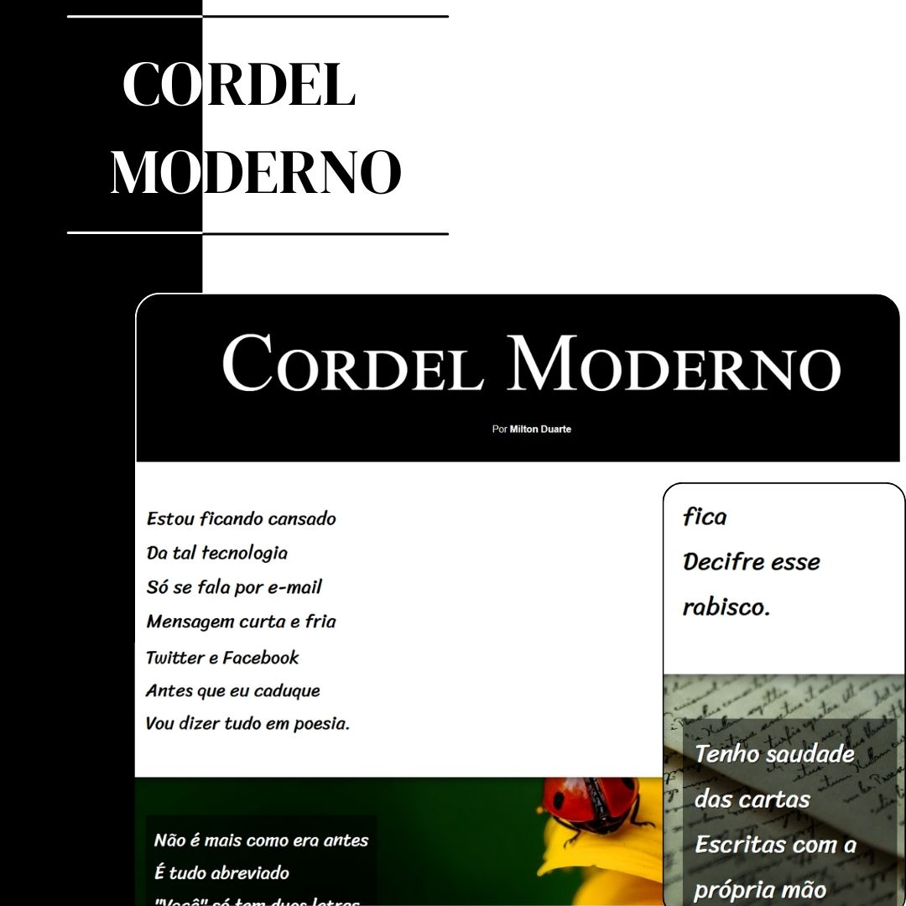
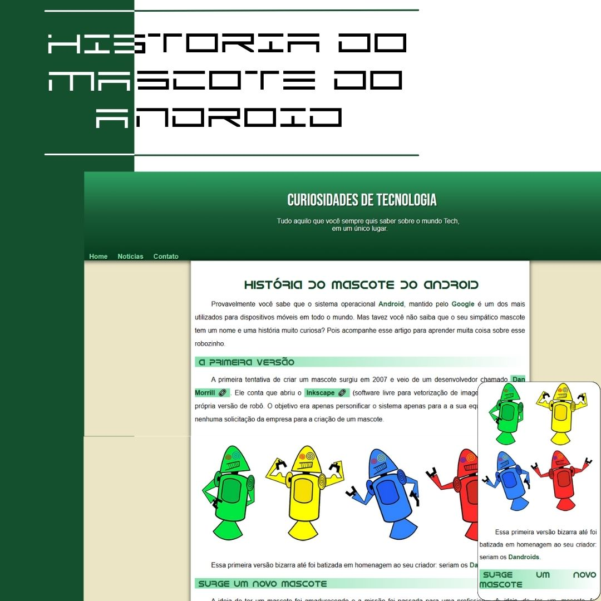
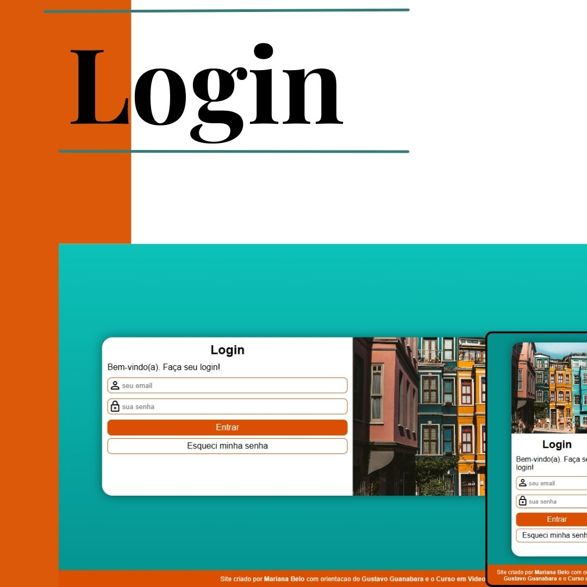

<h1 align="center">Repositório de HTML5 e CSS3</h1>

 ## 📲 Acesse
 <a href='https://linkedin.com/in/marianabelo26/' target='_blank'><strong>LinkedIn</strong></a>
  
 <a href='https://instagram.com/in/mariana_.belo/' target='_blank'><strong>Instagram</strong></a>
 
<h2>Conheça meus projetos</h2>

<h3 align="center">Projeto <a href='https://marianabelo26.github.io/html-css/projeto-cordel/cordelmoderno.html' target='_blank'>Cordel Moderno</a></h3>

  

## 💻 Projeto

O Cordel Moderno é um site que conta um cordel com efeito Parallax simples, desenvolvido durante o curso de HTML5 e CSS3 do Curso em Video.

<h3 align="center">Projeto <a href='https://marianabelo26.github.io/html-css/projeto-site-android/index.html' target='_blank'>História do Mascote do Android</a></h3>

  

## 💻 Projeto

História do Mascote do Android é um site simples que conta a desenvolvimento do mascote do Android e com imagens e video adaptavel aos tamanhos de telas, desenvolvido durante o curso de HTML5 e CSS3 do Curso em Video.

<h3 align="center">Projeto  <a href='https://marianabelo26.github.io/html-css/projeto-tela-login/index.html' target='_blank'>Tela de Login</a></h3>

  

## 💻 Projeto

Tela de Login é um site com desenvolvimento de formulário e medias queries para diversas telas, desenvolvido durante o curso de HTML5 e CSS3 do Curso em Video.

 

## 🚀 Tecnologias

Esses projetos foram desenvolvidos com as seguintes tecnologias:

- HTML
- CSS
- Git e Github
